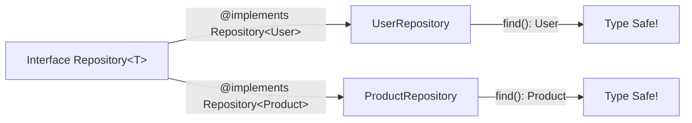
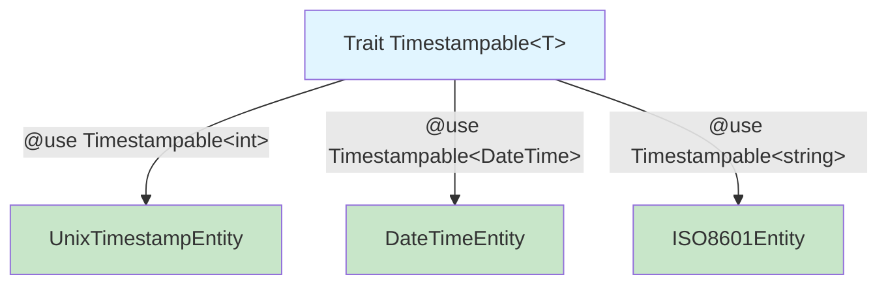
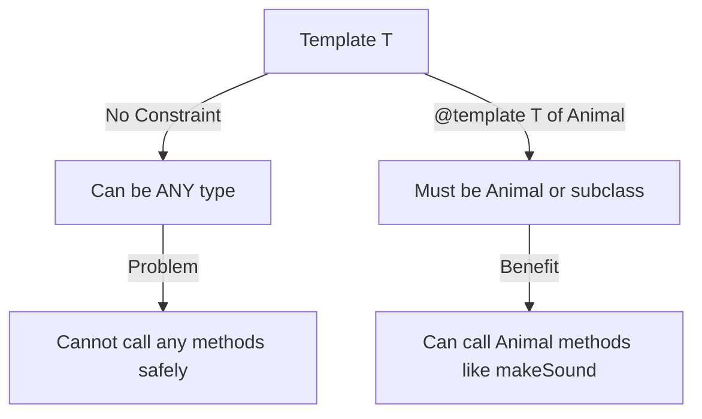
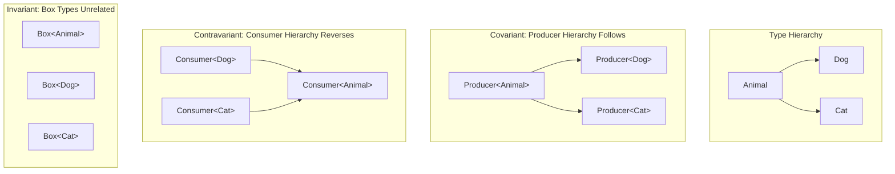

# Generic Types in Phan v6

> This is the current documentation for Phan v6 (the latest stable release).

Phan v6 significantly expands support for generic (templated) classes, interfaces, traits, and functions using PHPDoc annotations with `@template` and related tags. This allows you to write type-safe, reusable code that works with multiple types while maintaining strong static analysis.

## What Are Generics?

Generics (also called "templates" or "parametric polymorphism") allow you to write code that works with multiple types while preserving type safety. Instead of writing separate `IntList`, `StringList`, `UserList` classes, you write one `List<T>` class that works with any type.

**The Problem Without Generics:**
```php
// Without generics, you lose type information
class Container {
    private $value;

    public function __construct($value) {
        $this->value = $value;
    }

    public function get() {
        return $this->value;  // Phan can't know what type this is!
    }
}

$box = new Container("hello");
$value = $box->get();  // Phan thinks $value is mixed
```

**[Try this example in Phan-in-Browser →](https://phan.github.io/demo/?c=DwfgDgFmBQD0sAIDqBLALhA9gVzQg5gKYB2hATigMYDOANAgJ44IA2m1hCaDYnKxAM0xkAtgEM0KTMWiUWY6tQQBhaWjH9yCAN7QE+hGAoA3CZwAkpltkIBuaHoNhsAIxZUEA7MUqTpCAH0AymlqNDJsXwAKSzFrQgBKHUcDA3MMFGoAWgA+KxsEAF4EWPj7VIBfB1TnNw8vHz9iAkI0KKTdVNSyVuwyZvSITNz8u314BAAFCDFmylmAcjwAa2JMAHcEdZm8bl4uIaVMgEIUhCqq6HMXTAAPIoRSTdVidU0yKIAiCEIWNk+EvZSgVitc7rkiG1AeNENNZgd+MslMC+EoRChboQACZAA&php=84&phan=v6-dev&ast=1.1.3)**

**With Generics:**
```php
/**
 * @template T
 */
class Container {
    /** @var T */
    private $value;

    /** @param T $value */
    public function __construct($value) {
        $this->value = $value;
    }

    /** @return T */
    public function get() {
        return $this->value;
    }
}

$box = new Container("hello");  // Phan infers Container<string>
$value = $box->get();  // Phan knows $value is string!
```

**[Try this example in Phan-in-Browser →](https://phan.github.io/demo/?c=DwfgDgFmBQD0BU9oAJ7IAIBcCmBbMANgIY7IAqK8s0AxsQM73IDCA9gHaZECW72ATsgDeKZGIRp0ANyKCyqamLFh+3GaQAkMggFdsAbmijxiDGFlFc5ZFqK7sC48jA6ARgW41kAMx3samNwcyAD6ITQc9Jj8OgEAFLb2AJTCTko2mBDc9AC0AHzaesgAvDaFBk4AvkbpEhj82Jg6-OzWVE4u7p4+fgFBrQDmjXEpIunpDU0tGVm5BXZ6hunV1dAarqwAHiXIfADuLBxcvAJxAEQQ2AQErGdJ+uKwyAAKEEStvN4CTGycPHz8YBRVTsAZ5NblHbrLb5IaYEYPZCwJ6vd7IADW7FYeyYiSK2WQwN4AwAhEA&php=84&phan=v6-dev&ast=1.1.3)**

**Benefits:**
- **Type Safety**: Catch type errors at analysis time
- **Code Reuse**: Write once, use with many types
- **Better IDE Support**: Autocomplete knows exact types
- **Self-Documenting**: Generic signatures show type relationships
- **Refactoring Safety**: Type changes propagate correctly

## Why Generics in PHP?

PHP is dynamically typed and supports union types (`int|string`), intersection types (`Countable&ArrayAccess`), and even DNF types - so why do we need generics?

**The fundamental problem:** PHP's native type system cannot express *relationships* between types. Consider a simple container class:

```php
class Container {
    public function __construct(
        private object $value
    ) {}

    public function get(): object {
        return $this->value;
    }
}

$userContainer = new Container(new User());
$user = $userContainer->get();  // Returns 'object', not 'User'!
```

You can't write `function get(): typeof($this->value)` in PHP - there's no way to say "the return type is whatever type was passed to the constructor." Union types don't help here because `User|Product|Article|...` quickly becomes unmaintainable.

**Why this matters in PHP specifically:**

1. **Array transformations**: PHP's `array_map()`, `array_filter()`, etc. lose type information without generics
2. **Collections and data structures**: SPL classes like `SplObjectStorage` work with `mixed` types
3. **Repository patterns**: Common in PHP frameworks, need type safety across different entity types
4. **Factory patterns**: Can't express "this factory creates instances of type T" with native types
5. **Functional programming**: Closures and callbacks need type preservation through transformations

Generics in Phan annotations solve this by allowing static analysis to track these type relationships, even though PHP's runtime doesn't enforce them. This gives you IDE autocomplete, refactoring safety, and early error detection without runtime overhead.

**What's New in v6:**
- Generic interfaces with `@implements` / `@phan-implements`
- Generic traits with `@use` / `@phan-use`
- Template constraints with `@template T of SomeClass`
- Variance annotations: `@template-covariant` and `@template-contravariant`
- Utility types: `key-of<T>`, `value-of<T>`, `int-range<min, max>`, `positive-int`, `negative-int`

## Table of Contents

1. [Basic Generic Classes](#basic-generic-classes)
2. [Generic Interfaces](#generic-interfaces)
3. [Generic Traits](#generic-traits)
4. [Template Constraints](#template-constraints)
5. [Variance Annotations](#variance-annotations)
6. [Function Templates](#function-templates)
7. [Utility Types](#utility-types)
8. [Built-in Generic Types](#built-in-generic-types)
9. [Rules and Limitations](#rules-and-limitations)

## Basic Generic Classes

### Declaring Template Types

All template types for a generic class must be declared on the class via doc block comments using the `@template` annotation.

```php
/**
 * A generic box that holds a value of type T
 * @template T
 */
class Box {
    /** @var T */
    private $value;

    /** @param T $value */
    public function __construct($value) {
        $this->value = $value;
    }

    /** @return T */
    public function get() {
        return $this->value;
    }
}

// Phan infers Box<int> from the constructor argument
$intBox = new Box(42);
$val = $intBox->get();  // Phan knows this is an int

// Phan infers Box<string> from the constructor argument
$strBox = new Box("hello");
$str = $strBox->get();  // Phan knows this is a string
```

**[Try this example in Phan-in-Browser →](https://phan.github.io/demo/?c=DwfgDgFmBQD0BU9oAJ7IILIOYFMB2OATgJYDGyARgPYAeyALhAIb3IRUA2AJgM7JPIAbkw4BXHMioAzBgE8wEgCoo0AAXo4AtmA4slK2NFK6efAEK1kAbxTI7CNcMLJFqQ3btgSwjcgAkwmI4ANzQtvaIyKpgTIRMmi7+geJu4chgohQcZMhSonik9MRUeMgA+mWkJTz0hKKFABQBIuIAlNZpHv6MxDwAtAB8yRIAvEktIWkAvmFdDlGEOPSihKWu8O4eGVk5eQVFJdhLDe02XV2Ly6vdEL2Dw6FdMzNwsMgACsylxHhSROa0YA-egDXKEKgJRgSKp4Gp1QpUZyxLCiTT4ejQPzAix0MYEADuyBxDQALAAmVqhZocZBjLF4eg4wa4egnYL2N6fJilADWeCo+L4PT4vX43wZYVgnK+yB+f0IAJowDhPywoKk4MhEGh1Vq9XoiP4hBRaIlfjhONpyAJRNoDQARNqOBwqPbKZi4VbzbUmQMWWyOR8ZXyBULbiK+AIVXgsEA&php=84&phan=v6-dev&ast=1.1.3)**


### Template Types and Constructors

**Best Practice:** Template types should be used in constructor parameters to enable type inference. This allows Phan to automatically determine the generic type from constructor arguments.

```php
/**
 * @template T
 */
class Container {
    /** @var T */
    protected $item;

    /** @param T $item */
    public function __construct($item) {
        $this->item = $item;
    }
}

$stringContainer = new Container("hello");
// Phan infers Container<string> from the argument
```

**[Try this example in Phan-in-Browser →](https://phan.github.io/demo/?c=DwfgDgFmBQD0BU9oAJ7IAIBcCmBbMANgIY7IAqK8s0AxsQM73IDCA9gHaZECW72ATsgDeKZGIRp0ANyKCyqamLFh+rHDRwATZABJuOXAG5oo8YgxhZRXOV368C08jABXAEYFuNZADMX7DW4OZAB9EJoOekx+Fw0ACj0DAEphJyVdTAhuegBaAD57GwBeOwNjdIBfaAqgA&php=84&phan=v6-dev&ast=1.1.3)**

**What if template types aren't in the constructor?**

If template types aren't used as constructor parameters, Phan will:
1. Emit a `PhanGenericConstructorTypes` warning
2. Default the template type to `mixed`, losing type safety

```php
/**
 * @template T
 */
class Box {
    /** @var T */
    private $value;

    public function __construct() {
        // T is not used - Phan can't infer it!
    }

    /** @param T $value */
    public function set($value): void {
        $this->value = $value;
    }

    /** @return T */
    public function get() {
        return $this->value;
    }
}

$box = new Box();  // Warning: T defaults to mixed
$box->set("hello");
$box->set(42);     // No error - T is mixed, not string!

// To get type safety, use an explicit annotation:
/** @var Box<string> $typedBox */
$typedBox = new Box();
$typedBox->set("hello");  // Now T is string
```

### Extending Generic Classes

Classes extending generic classes need to fill in the types of the generic parent class via the `@extends` annotation.

```php
/**
 * @template T
 */
class Box {
    /** @var T */
    protected $value;

    /** @param T $value */
    public function __construct($value) {
        $this->value = $value;
    }
}

// Concrete type parameter
/**
 * @extends Box<int>
 */
class IntBox extends Box {
    public function __construct(int $value) {
        parent::__construct($value);
    }
}

// Passing template through
/**
 * @template T2
 * @extends Box<T2>
 */
class GenericBox extends Box {
    /** @param T2 $value */
    public function __construct($value) {
        parent::__construct($value);
    }
}
```

**[Try this example in Phan-in-Browser →](https://phan.github.io/demo/?c=DwfgDgFmBQD0BU9oAJ7IAIBcCmBbMANgIY7IAqK8s0AxsQM73IBCA9gB7IDeKyfCadADciAJ3KpqfPmFGscNHABNkAEhEEArtgDc0Xv0QYwYorgnqiW7JIPIwmgEYEAljWQAzTQDtFL1t7IAPpBNAH0mKKaigAUltYAlNx20mqYEC70ALQAfBrayAC8avm6dgC+0JVwsMgAwgE0otikmACeYDYmomYt2KJwiJQY2Ow43kpMbOzALt6YOZTUdESMyACS89PIo+OTLBzJqQ7Obp4+fgHBoeGR0Zgxc5glVtpJPKnHYtjzAFy-ITC3giUVi8TeelSlWqsFqAAVVvQ5gBzZA4fDEVoQOSaZEQQZIVAYdGEEg2MgAJmG6F2P3202AlMWthWawA4j9+m5trSJlNDh9pAJjKZzJSXtZbMcnK53F5fJh-IFAbdQQ9wdh3ilpN0fph-irgXcwaUEpDpNCgA&php=84&phan=v6-dev&ast=1.1.3)**

### Template Type Inference

One of the most powerful features of generics in Phan is automatic template type inference. You often don't need to explicitly specify template arguments - Phan can infer them from the values you pass.

**How It Works:**

Phan analyzes constructor arguments, function parameters, and return types to automatically determine template type arguments. This makes generics convenient to use while maintaining full type safety.

**Inference from Constructor:**

```php
/**
 * @template T
 */
class Box {
    /** @var T */
    private $value;

    /** @param T $value */
    public function __construct($value) {
        $this->value = $value;
    }

    /** @return T */
    public function get() {
        return $this->value;
    }
}

// Phan infers Box<string> from the argument
$stringBox = new Box("hello");
$str = $stringBox->get();  // Phan knows this is string

// Phan infers Box<User> from the argument
$userBox = new Box(new User('Alice'));
$user = $userBox->get();  // Phan knows this is User
```

**Inference from Function Parameters:**

```php
/**
 * @template T
 * @param list<T> $items
 * @return T|null
 */
function firstOrNull(array $items) {
    return $items[0] ?? null;
}

$numbers = [1, 2, 3];
$firstNum = firstOrNull($numbers);  // Phan infers T = int
// $firstNum is int|null

$users = [new User('Alice'), new User('Bob')];
$firstUser = firstOrNull($users);  // Phan infers T = User
// $firstUser is User|null
```

**Inference Through Method Chains:**

```php
/**
 * @template T
 */
class Collection {
    /** @var list<T> */
    private array $items;

    /** @param list<T> $items */
    public function __construct(array $items) {
        $this->items = $items;
    }

    /**
     * @template U
     * @param callable(T): U $mapper
     * @return Collection<U>
     */
    public function map(callable $mapper) {
        return new Collection(array_map($mapper, $this->items));
    }

    /** @return list<T> */
    public function toArray(): array {
        return $this->items;
    }
}

$products = new Collection([
    new Product('Laptop', 999.99),
    new Product('Mouse', 29.99),
]);
// Phan infers Collection<Product>

$names = $products->map(fn($p) => $p->name);
// Phan infers Collection<string> from the lambda

$nameArray = $names->toArray();
// Phan knows this is list<string>
```

**Inference from Closure Return Types:**

```php
/**
 * @template T
 * @param callable(): T $factory
 * @return T
 */
function lazy(callable $factory) {
    return $factory();
}

// Phan infers T = User from the return type annotation
$user = lazy(function(): User {
    return new User('Lazy');
});
// $user is User

// Phan infers T = int
$number = lazy(fn(): int => 42);
// $number is int
```

**When Inference Isn't Enough:**

Sometimes Phan can't infer the type, or you want to be explicit. You can always use `@var` annotations:

```php
/**
 * @template T
 */
class Stack {
    /** @var list<T> */
    private array $items = [];

    /** @param T $item */
    public function push($item): void {
        $this->items[] = $item;
    }
}

// Inferred from first push (but might not be what you want)
$stack1 = new Stack();
$stack1->push(1);

// Explicit - ensures type safety from the start
/** @var Stack<int> $stack2 */
$stack2 = new Stack();
$stack2->push(1);
```

**Why Inference Matters:**

1. **Less Verbose**: No need to write `new Box<string>("hello")` like in other languages
2. **Refactoring Friendly**: Change a type in one place, inference propagates automatically
3. **IDE Support**: Your IDE can autocomplete based on inferred types
4. **Gradual Typing**: Add type specificity where it matters most

## Generic Interfaces

**New in v6:** Phan now supports generic interfaces using the `@implements` annotation.

### Why Generic Interfaces?

Interfaces define contracts - what methods a class must implement. Generic interfaces extend this by allowing the contract to be parameterized by types. This is incredibly powerful for creating reusable patterns.

**Common patterns that benefit from generic interfaces:**
- Repository pattern: `Repository<T>` ensures type-safe data access
- Factory pattern: `Factory<T>` guarantees what type it produces
- Iterator pattern: `Iterator<T>` knows what type it iterates over
- Command pattern: `Handler<TCommand>` knows what command it handles



### Declaring Generic Interfaces

```php
/**
 * @template T
 */
interface Repository {
    /**
     * @param int $id
     * @return T
     */
    public function find(int $id);

    /**
     * @param T $entity
     */
    public function save($entity): void;
}
```

**[Try this example in Phan-in-Browser →](https://phan.github.io/demo/?c=DwfgDgFmBQD0BU9oAJ7IAIBcCmBbMANgIY7IAqK8s0AlgHY4BOAZkQMbbIBK2YA9gGcamPowCeyAN4pkshElmK06MEUZFcyepmQASGgBMZSjI2yYArozrljsqnbAWARgRptkzC3TaYafG2Z6AwAKbT1DAEoAbmg7eTtUDFV1TTI9bAZhMUSHRWQnV3dPb19-GwEiADdsEN1Mv0wxSIAuZCq+Q1iAXyA&php=84&phan=v6-dev&ast=1.1.3)**

### Implementing Generic Interfaces

Use the `@implements` annotation to specify the template type when implementing a generic interface:

```php
class User {
    public string $name = '';
}

/**
 * @implements Repository<User>
 */
class UserRepository implements Repository {
    public function find(int $id): User {
        return new User();
    }

    public function save($entity): void {
        // Phan knows $entity is User
        echo $entity->name;
    }
}

$repo = new UserRepository();
$user = $repo->find(1);
echo $user->name;  // Phan knows $user is User
```

**[Try this example in Phan-in-Browser →](https://phan.github.io/demo/?c=DwfgDgFmBQDGA2BDAzsgBAVWQUwE5oG9o0S0wBXAI3gEtY1kAXXGgOwHM0ASVxAW2xoAvGgDkogNzQAvtGgB6AFSLiitAAEafMPGwDWjdACVsYAPbIajM7gCewLHgB8q+XCSpMOXCfOXrdmhaOnrYBsamFlY2toTEpBTUdGgAZuSssIw0ZqypbAAmABRsjNw0+QCUAFxeeHGkDWi42IzkuLms2ADutbiFFVINsvEkibT0aRlZOQyIAG7YhVxhWYy21WhzZuX1jSTy8mgAChCIuQDWrGZd6MsGVrE06I64I43YsBBm3CsPALROXgCQakWTDLjNczCNCdHovXxRAK2fpSLjkbzQiGRAEpAqFACMA2gHy+3HReABQOwEn2hxOZzQl2ut3J+CevSAA&php=84&phan=v6-dev&ast=1.1.3)**


### Multiple Interfaces

You can implement multiple generic interfaces with different template parameters:

```php
/**
 * @template TKey
 * @template TValue
 * @implements Iterator<TKey, TValue>
 * @implements ArrayAccess<TKey, TValue>
 */
class Collection implements Iterator, ArrayAccess {
    /** @var array<TKey, TValue> */
    private $items = [];

    // Iterator implementation...
    public function current(): mixed { return current($this->items); }
    public function key(): mixed { return key($this->items); }
    public function next(): void { next($this->items); }
    public function rewind(): void { reset($this->items); }
    public function valid(): bool { return key($this->items) !== null; }

    // ArrayAccess implementation...
    public function offsetExists(mixed $offset): bool {
        return isset($this->items[$offset]);
    }
    public function offsetGet(mixed $offset): mixed {
        return $this->items[$offset];
    }
    public function offsetSet(mixed $offset, mixed $value): void {
        $this->items[$offset] = $value;
    }
    public function offsetUnset(mixed $offset): void {
        unset($this->items[$offset]);
    }
}
```

**[Try this example in Phan-in-Browser →](https://phan.github.io/demo/?c=DwfgDgFmBQD0BU9oAJ7IAIBcCmBbMANgIY7IAqA0tgJ4ppZ6EnbkBqRBArtnRgJb4CebADtMAZ2QBJHACcSAe1nBKNADRsO3AHy90AwsLGSAgrPnUTAYyvZx4lVWoay7Ltl2pY0K8XvIAYQUCIStMPgURZAMhXFEJaTlFWQ0zC2tbfwBvFGQ8hHoANyJZZBKLR3VNd20vXLywWT5i0gASPhxcSQBeZABtAF0Abmh65FhYROx5TCVowSNMEgiRADp1sbBOACMCPitkADNOETCV5CtOc3iACgBKAC5kXD4AD2wAE2Qs5FlsTCuUUu1zEN1amAgfHEAFptB08OI7kNkABfTY7PYHY6ncKRZAAaxo9yeL3eXx+fwBsiihOoYIhUNh8K6SNR6N2+yOJzOeJE2FemGJyEKCj45OQfIF9MhMLhnURyLReQaGM52J5UT+AHc+CIPkKRWLvr87P9pYy5QjWUrlVsOVjubiosU9vrHshtgpgsbKYCCUTwTKmfK7sgAITdXoiTghRWjZXjSZpIiWGx2SQxRbLSLrVbszFcnHnBSHQ7if4AUVeUIkN1Jn2QrRLZf+7s93pyCYTvup0XsZsDFuZ4j6TdL5cwAyRYxtKvthY1yGbE4A4mb618xy3MO6N98xt3-n7B7Lh6Pl-9hjP82rHcXx-8AMrrt4NrcTjR71ou7juw3kg9lRPYMEXPB9J2QXpvy0bARgTWdkDtAt1SdJdwIAVRECc61fTcLx3J5-33LtlRObDgMtLowO3Kc4OVNEUSAA&php=84&phan=v6-dev&ast=1.1.3)**

### Nested Generic Types

Template parameters can themselves be generic:

```php
/**
 * @template T
 */
interface Repository {
    /** @return T */
    public function find(int $id);
}

/**
 * @implements Repository<array<string, User>>
 */
class UserMapRepository implements Repository {
    /**
     * @return array<string, User>
     */
    public function find(int $id): array {
        return ['user' => new User()];
    }
}
```

**[Try this example in Phan-in-Browser →](https://phan.github.io/demo/?c=DwfgDgFmBQD0BU9oAJ7IAIBcCmBbMANgIY7IAqK8s0AlgHY4BOAZkQMbbIBK2YA9gGcamPowCeyAN4pkshGnSNsmAK6M65VNVmywKgEYEabZMxV02mGnw3N6AEwAU9TMgAkNewEoA3NAC+0HCIlBg0+AR42AwC3LyCwqJiwESMjETJApiM9ADmADTIAKoC2IwAfOWU1GzEArElZQCyRGA8-EIi4sjhhFExcR2J3dI6yPIyOgpKqurIqemZ2XmFjRWTslQbeobGpuaW1rYOzgzunl4AXPNpGVIbYzNqGgDaAOQqpYxvyAC85cg6NgAO7FL6OLwAXT8Y0C-iAA&php=84&phan=v6-dev&ast=1.1.3)**

### Alternative: `@phan-implements`

You can use `@phan-implements` if you want to use Phan-specific annotations that don't interfere with other tools:

```php
/**
 * @template T
 * @phan-implements Repository<T>
 */
class GenericRepository implements Repository {
    // Implementation...
}
```

**[Try this example in Phan-in-Browser →](https://phan.github.io/demo/?c=DwfgDgFmBQD0BU9oAJ7IAIBcCmBbMANgIY7IAqKa6kRAdgLQCW+Be2tmAzsgErZgB7To0wCATgE9gZAHyVY0AMbFO3AOLtsYxor6DhoycmaE2HbnqEjxE5AG8UyJ7FjIAkizOYSjAbQB0gdAAvkA&php=84&phan=v6-dev&ast=1.1.3)**

## Generic Traits

**New in v6:** Phan now supports generic traits using the `@use` annotation.

### Why Generic Traits?

Traits provide code reuse through horizontal composition - you can add common functionality to multiple unrelated classes. Generic traits take this further by making that shared functionality type-safe.

**When to use generic traits:**
- **Cross-cutting concerns**: Logging, caching, timestamps that work with any entity type
- **Mixins**: Add functionality like `Comparable<T>` or `Serializable<T>` to multiple classes
- **Implementation sharing**: Share common logic across different entity types
- **Avoiding inheritance**: Add behavior without creating deep inheritance hierarchies

**Key advantage over inheritance:** A class can use multiple traits with different type parameters, but can only extend one parent class.



### Declaring Generic Traits

```php
/**
 * @template T
 */
trait Repository {
    /** @var list<T> */
    private $items = [];

    /**
     * @param T $item
     */
    public function add($item): void {
        $this->items[] = $item;
    }

    /**
     * @return T|null
     */
    public function first() {
        return $this->items[0] ?? null;
    }
}
```

**[Try this example in Phan-in-Browser →](https://phan.github.io/demo/?c=DwfgDgFmBQD0BU9oAJ7IAIBcCmBbMANgIY7IAqK8s0mATkQJabIBK2YA9gM5Me0CeyAN4pkYhGnQA3IrWQEGXTMDIA+VNTFiwtBjNIASJni7IAvMgDaAXQDc0UeMSOxksLKK5yyIzlwuNFzAAVwAjBQBjZAAzYIA7CMwGDjjkIgATdIAKXzwASgAuZCkOBnThAK0DTAhFAFpVY1wuG3MfJvstZABfBy6JAMlabExg2lSyAB844IICQc0tEPCGKNiEpJSYhlolLLyKrq7h0fGfGvrGvxaABmtkEBBkGbnOrV7uoA&php=84&phan=v6-dev&ast=1.1.3)**

### Using Generic Traits

Use the `@use` annotation to specify the template type when using a generic trait:

```php
class Article {
    public string $title = '';
}

/**
 * @use Repository<Article>
 */
class ArticleService {
    use Repository;
}

$service = new ArticleService();
$service->add(new Article());
$article = $service->first();  // Phan knows this is Article|null
echo $article->title;
```

**[Try this example in Phan-in-Browser →](https://phan.github.io/demo/?c=DwfgDgFmBQDGA2BDAzsgBAQQE4BcCWCApmgN7RoVpgCuARvAWsjlngHYDmaAJPjvMQC8aAOQiA3NAC+0aAHoAVAvIK0AAWrJiAJUJgA9sjw59WAJ7Bs+IgD4VcuElSZcBAQGVCWAG4FiZSjRNHT1DY1MzSRlobi0fPzRhNkIAdxdrDy9fWEIACgBKSVisvwBaG0QAE0rc5LSrNzz8wpjEVyJEnjjswnKAMzwsZgLxCjk5NAAFCEQ2NABrNn0U9BwIPHQN9MaAHzZqeHhoQlgIfR42jN6bPgFxIA&php=84&phan=v6-dev&ast=1.1.3)**


### Combining Class Templates with Trait Templates

```php
/**
 * @template T
 */
trait Storage {
    /** @var T */
    private $data;

    /** @param T $value */
    public function store($value): void {
        $this->data = $value;
    }

    /** @return T */
    public function retrieve() {
        return $this->data;
    }
}

/**
 * @template T
 * @use Storage<T>
 */
class Container {
    use Storage;

    /** @param T $initial */
    public function __construct($initial) {
        $this->store($initial);
    }
}

$container = new Container(42);
$value = $container->retrieve();  // Phan knows this is an int
```

**[Try this example in Phan-in-Browser →](https://phan.github.io/demo/?c=DwfgDgFmBQD0BU9oAJ7IAIBcCmBbMANgIY7IAqK8s0mATkQJabIDKmA9vQObbIDeKZEIRp0ANyK1yqakKFhaDCaQAkAExJEA3NEHDEGMJKK5pKiQQCuvKnuRhLAIwIMAxsgBmlgHavMDdm9kAGcOWmwACnMiK2wASgAuZDF2BjV+OzlkFUwIBmCAWgA+DUwiZABebItrHSyAX10skQxwzEtaILIZOwdnN08fPwCgtsVsMUi4jKysto6gnLzCks06uUbGuERKDBx8YlIKVAxLYN42TiIeYDIiympXYmDg5ABhQLKGb2wpASyzhcwtdsDo7C10EZ6KZuipvkwGDEelk+i53F5fP5AsgAPo41yBUK0Sx+KLw-wxab-WZCJb5YqhTiROHeBGU9ZCTa6FQE7xfH5SKo-ADu70+jAFEQALAAmOI6aKxSrZXn837FMYMCZTLTCWDIAAKECIQQA1t52MLXrl8shbSa7XygA&php=84&phan=v6-dev&ast=1.1.3)**

### Alternative: `@phan-use`

Similar to `@phan-implements`, you can use `@phan-use` for Phan-specific annotations:

```php
/**
 * @template T
 * @phan-use Repository<T>
 */
class Service {
    use Repository;
}
```

**[Try this example in Phan-in-Browser →](https://phan.github.io/demo/?c=DwfgDgFmBQD0BU9oAJ7IAIBcCmBbMANgIY7IAqKa6kRAdgLQCuAztsgErZgD2zAlpm4AnAJ7AyAPkqxoAY2LNmyAMrYhANz6y2AbxTIDLNpx79BogNzQAvkA&php=84&phan=v6-dev&ast=1.1.3)**

## Template Constraints

**New in v6:** Template parameters can be constrained to specific types using `@template T of SomeClass`.

### What Are Template Constraints?

Without constraints, a generic class can be instantiated with *any* type. This means Phan cannot assume anything about the template parameter - you can't call methods on it or access properties. Template constraints solve this by specifying that a template parameter must be a specific type or its subtype.

**Why use constraints?**
- **Type Safety**: Prevent invalid type arguments at analysis time
- **Method Access**: Call methods/access properties that are guaranteed to exist
- **Documentation**: Make the requirements of your generic code explicit
- **Better IDE Support**: Autocomplete works because the constraint defines available methods



### Basic Constraints

Let's see how constraints enable type-safe generic code:

```php
class Animal {
    public function makeSound(): string {
        return "some sound";
    }
}

class Dog extends Animal {
    public function makeSound(): string {
        return "woof";
    }
}

class Cat extends Animal {
    public function makeSound(): string {
        return "meow";
    }
}

/**
 * @template T of Animal
 */
class Shelter {
    /** @var T */
    private $resident;

    /** @param T $animal */
    public function __construct($animal) {
        $this->resident = $animal;
    }

    /** @return T */
    public function getResident() {
        return $this->resident;
    }

    public function hearSound(): string {
        // Phan knows $resident has makeSound() method
        return $this->resident->makeSound();
    }
}

// OK: Dog extends Animal
/**
 * @extends Shelter<Dog>
 */
class DogShelter extends Shelter {}

// ERROR: string does not extend Animal
/**
 * @extends Shelter<string>
 */
class InvalidShelter extends Shelter {}
```

**[Try this example in Phan-in-Browser →](https://phan.github.io/demo/?c=DwfgDgFmBQDGA2BDAzsgBAQQHYEsC2i8aA3tGuWmAK4BG8OsaAZlVrAC44D2WaBA1gFMAyl1YATABQBKAFxpk7AE44sAcxJkK2pYPZUlvAETIueQQrFZxRgNxbyAX2jO4SVGgAiXDYIAe7ILW6Nj4hJra1HQMzKwc3LwCIlZScgrKqhqk2jp6BsYA7lxcTHYOaM6uCCjoAMKI7Gj+gcGYuARE2RRR9IwsbJw8fIhCohIy8ooq6hE55Lr6hmhG5lwFZdqV0NAA9ABUe2R7aAACgXhgSIFoACpoJW1h8Ec7bjVowhCC8IFKs+T7Y4nABuiD+dz2r0iKlB1wAJLpkDhxEF2PZyoDTmAwYg8Lc0HDEO1wpDyj0Yv14kMAPrU2A8KZUDiSQnE+DSf45OHsCA4ZAAWgAfIjkai0ABeAlEp72TbbbSYk4LfL40mRWi9WIDBJoNR6ABKgiRKKw7BknNyi143N5AuFRtFptlFFc6uifTig14XzBY2sE3S0yy5QVOzQAAUIES0PwsGt0AiHSbGlH0Ek-ak+HoIFxxCGKMqlja+UKRcmhemUjJnU4XNsdmGAPIAaXk3l8ASC4hCbN2ByOp2aXfQn2+v2A7cFLzeHnbo5+gj+Q9a89+JFcDbQAFF9frG-rJhkZuIuEa0HHGsvxI8On3DmggVeR18F0pgFNMlOH69qh4AJJYKC9DiKui5NJ2K4vmuxCOEAA&php=84&phan=v6-dev&ast=1.1.3)**

### Constraints with Interfaces

```php
interface Timestamped {
    public function getTimestamp(): int;
}

/**
 * @template T of Timestamped
 */
class TimestampedCollection {
    /** @var list<T> */
    private $items = [];

    /** @param T $item */
    public function add($item): void {
        $this->items[] = $item;
    }

    /**
     * @return T|null
     */
    public function getMostRecent() {
        $latest = null;
        foreach ($this->items as $item) {
            if ($latest === null || $item->getTimestamp() > $latest->getTimestamp()) {
                $latest = $item;
            }
        }
        return $latest;
    }
}
```

**[Try this example in Phan-in-Browser →](https://phan.github.io/demo/?c=DwfgDgFmBQCWB2AXApgJwGYEMDGyAEAKrALbIDOimxYyAJngN7R4t5gCuARgDazZ7p28bIlgB7eHgDmyREVIUqYABQBKAFx4EiANzQAvtGgB6AFSnmpvAAEU1bphSE8Y9IRLlK1OpePRsDmRk7gpeNLQAwmLc3Mgi4pJMrHhmVtYAbpioeLwUwAQAfHimfslgqLCZTgAksHbBALx4ANoAunrMrKk2YFlUzrV2xaWsHDx8AkLxEniYtLTKg8jEGnjpYrD0Scms1YgQsGQAtAV1y2RteE1LxHrJhp0sqY8saaiy7KiSBAA+8OwxF7DF5jXj8QTCUQzGSIACyYgoACU4sgkGpGEDdg4UBQrnh-jE7jsWOgxO8cBA8It9ocTmdiMFMMEbqoMcTibA3ItsZ4rg0mgTuHgfj88DcTjD5J4lOiitUeRQJbIpYpqGpWdt2ez5Y5edd6UStSxDFqTez3ohPpIdTjdC9DPogA&php=84&phan=v6-dev&ast=1.1.3)**

### Constraints on Functions

Template constraints work on functions and methods too:

```php
/**
 * @template T of Animal
 * @param T $animal
 * @return T
 */
function cloneAnimal($animal) {
    return clone $animal;
}

$dog = new Dog();
$clonedDog = cloneAnimal($dog);  // Phan knows this is Dog

// ERROR: string is not an Animal
$str = cloneAnimal("not an animal");
```

**[Try this example in Phan-in-Browser →](https://phan.github.io/demo/?c=DwfgDgFmBQD0BU9oAJ7IAIBcCmBbMANgIY7IAqyA9gGbICCAdgJa5EEprphEBORu5ZABIizVu1QYe2TAFceDch1jRqshgGNMTSoo0Fd2RizYAKEWLYBKZAG8UyR9LkLk+w8NEmCAbmgBfaGghABNKAHNkAF5kBmwAd2QAEQjTKz8hdziQlMiYrKNLAnMw8PTHWFhkAAUIUWQAawZKeIBnZEwIJnbu5IigyuQAUQAlEYB5EYAuZFbMHiYGSN7mzGR643FguZ5otwM4zbMAIlX1xS9xY-SgA&php=84&phan=v6-dev&ast=1.1.3)**

### Union Type Constraints

Constraints can be union types:

```php
/**
 * @template T of int|string
 * @param T $value
 * @return T
 */
function identity($value) {
    return $value;
}

identity(42);      // OK
identity("test");  // OK
identity(true);    // ERROR: bool is not int|string
```

**[Try this example in Phan-in-Browser →](https://phan.github.io/demo/?c=DwfgDgFmBQD0BU9oAJ7IAIBcCmBbMANgIY7IAqyA9gGbICWAdpgD4DOmATowOYprpgiHIrnLIAJADciBAK7Y+GDtkyyODcn1jRqshgGNMdShroATbEzqYAngAopM+QEpkAbxTIvy1eonS5bABuaABfaGhzSyNbOwAWACZnIK9U5FhYZAB5AGlIiytYgCIcdiLkrwzsvKjC+04XFNSqgFEAJTastoAuZAAjSkoCelZkBkpMeiY2Th4gA&php=84&phan=v6-dev&ast=1.1.3)**

### Intersection Type Constraints

**New in v6:** Constraints can require multiple interfaces:

```php
interface Serializable {
    public function serialize(): string;
}

interface Validatable {
    public function validate(): bool;
}

/**
 * @template T of Serializable&Validatable
 */
class Processor {
    /** @param T $item */
    public function process($item): string {
        if ($item->validate()) {
            return $item->serialize();
        }
        return '';
    }
}
```

**[Try this example in Phan-in-Browser →](https://phan.github.io/demo/?c=DwfgDgFmBQCWB2AXApgJwGYEMDGyAEAymrJgDawBemARqfgN7R7N5gCuts2e6b82iWAHt4eAM7EylZAAoAlAC5xiVAgDmAbmgBfaHCRosuPADUpAE0yIadPIxasO5br36CReAG4WrsxXmohIVItXWgAegAqSKZIvAABFABbMFJfPAAVPCF0QklyKlpkADIzcktrItjw6Gw0sTE8AAVUIVwGoVQ7JhYouPiwTFRMJMy8ABJYZLxImod2Thc+AWFRMFb2sRlJ5P8xFXVuhwdYXO2p5CSAWgA+b3LfeTkj49fUZEQ2VFEdy9uJVRSCh+LSvZi6MF4d6fb54ADkcNBLF02iAA&php=84&phan=v6-dev&ast=1.1.3)**

### Class String Constraints

One of the most powerful patterns in PHP is using `class-string<T>` to create type-safe factories, repositories, and dependency injection containers. This pattern is heavily used in Laravel, Symfony, and other modern frameworks.

**The Problem:** When you pass class names as strings to create instances, PHP and static analyzers lose all type information:

```php
function createInstance(string $className): object {
    return new $className();
}

$user = createInstance(User::class);  // Returns 'object', not 'User'!
```

**The Solution:** Use `class-string<T>` to preserve the type relationship:

```php
/**
 * @template T of object
 * @param class-string<T> $className
 * @return T
 */
function createInstance(string $className): object {
    return new $className();
}

$user = createInstance(User::class);  // Phan knows this is User!
```

**Real-World Example: Generic Repository Pattern**

This is the foundation of repository patterns in frameworks like Laravel and Doctrine:

```php
abstract class Entity {
    abstract public function getId(): int;
}

class User extends Entity {
    public function __construct(
        private int $id,
        public string $name,
        public string $email
    ) {}

    public function getId(): int {
        return $this->id;
    }
}

/**
 * @template T of Entity
 */
class Repository {
    /** @var class-string<T> */
    private string $entityClass;

    /** @var array<int, T> */
    private array $storage = [];

    /**
     * @param class-string<T> $entityClass
     */
    public function __construct(string $entityClass) {
        $this->entityClass = $entityClass;
    }

    /**
     * @param T $entity
     */
    public function save($entity): void {
        $this->storage[$entity->getId()] = $entity;
    }

    /**
     * @return T|null
     */
    public function find(int $id) {
        return $this->storage[$id] ?? null;
    }

    /**
     * @return list<T>
     */
    public function findAll(): array {
        return array_values($this->storage);
    }
}

// Type-safe repositories!
/** @var Repository<User> $userRepo */
$userRepo = new Repository(User::class);
$user = new User(1, 'Alice', 'alice@example.com');
$userRepo->save($user);

$foundUser = $userRepo->find(1);
// Phan knows $foundUser is User|null, not Entity|null!
```

**Real-World Example: Generic Factory Pattern**

Factories in dependency injection containers use this pattern:

```php
/**
 * @template T of object
 */
class Factory {
    /** @var class-string<T> */
    private string $className;

    /**
     * @param class-string<T> $className
     */
    public function __construct(string $className) {
        $this->className = $className;
    }

    /**
     * @param list<mixed> $args
     * @return T
     */
    public function create(array $args = []): object {
        $reflection = new ReflectionClass($this->className);
        return $reflection->newInstanceArgs($args);
    }
}

/** @var Factory<User> $userFactory */
$userFactory = new Factory(User::class);
$newUser = $userFactory->create([2, 'Bob', 'bob@example.com']);
// Phan knows $newUser is User, not object!
```

**Why This Matters in PHP:**

1. **Framework Integration**: Laravel's `Model::class`, Symfony's service containers, Doctrine's repositories all use this pattern
2. **Type-Safe DI Containers**: Register and resolve services without losing type information
3. **Dynamic Class Loading**: Safe runtime class instantiation with compile-time type checking
4. **Testability**: Mock factories and repositories while maintaining type safety

## Variance Annotations

**New in v6:** Phan supports variance annotations to enforce proper template usage in read/write positions.

### Understanding Variance

Variance describes how subtyping relationships between types relate to subtyping relationships between generic types. It's one of the most subtle concepts in type systems, but crucial for type safety.

**The Core Problem:**

If `Dog` is a subtype of `Animal`, should `Container<Dog>` be a subtype of `Container<Animal>`? The answer depends on how `Container` uses its type parameter.

**Three Types of Variance:**

1. **Covariant** (`@template-covariant T`): If Dog ⊆ Animal, then Container<Dog> ⊆ Container<Animal>
   - Safe when T only appears in "output" positions (return types, readonly properties)
   - Think: "Producers of T"

2. **Contravariant** (`@template-contravariant T`): If Dog ⊆ Animal, then Container<Animal> ⊆ Container<Dog>
   - Safe when T only appears in "input" positions (parameters)
   - Think: "Consumers of T"

3. **Invariant** (default): Container<Dog> and Container<Animal> are unrelated
   - Required when T appears in both input and output positions
   - Think: "Storage of T"



### Covariant Templates

**When to use:** Your class/interface only *produces* (returns) values of type T, never consumes them.

**Why it's safe:** If you have a `Producer<Dog>` and treat it as a `Producer<Animal>`, you're asking for an Animal and getting a Dog - which is always safe because Dog IS-AN Animal.

**Common use cases:**
- Read-only collections
- Iterators
- Factory interfaces
- Query result sets

```php
/**
 * @template-covariant T
 */
interface Producer {
    /** @return T */
    public function produce();
}

/**
 * @template-covariant T
 */
class ReadOnlyBox {
    /** @var T */
    private $value;

    /** @param T $value */
    public function __construct($value) {
        $this->value = $value;
    }

    /** @return T */
    public function get() {
        return $this->value;
    }

    // ERROR: covariant template in parameter position
    /** @param T $value */
    public function set($value): void {
        $this->value = $value;
    }
}
```

**[Try this example in Phan-in-Browser →](https://phan.github.io/demo/?c=DwfgDgFmBQD0BU9oAJ7IAIBcCmBbMANgIY4C0AxgPYBuRATgJZEB2myAKivLNA69nQBmRctmQAFOpQAmAV1F1kAbxTI1CNOjrZMsusw6oeatWFkAjAg3LJBs5uUwNKBsFLmiAFAEoA3NABfaDhELgwcfGIyKlpGFjZOI2hyYgBnVOQAJWwiaQB5ZgIATwAhSgAPZVV1RAxYw25q5DcGWhxkABJaAllsfyaNDDB6IlxDLqIesUaTZosrGzsHJxdkAH01qmZUzDp5TE8Jqe8q2dmOzAgGVNIAPm7e5ABeToe+pqCB2q0dPQN2JKzMyWay2eyOZwGADmOh8pzOam0un0nUu1zub38s0+s1gsGQAFFMpk8pkAFzIGL0JisZARQgkMR8ZojXA6ATNSipBgrZhfTTDOijcZvQEmYELMHLSHIVKwo69bwU6iUBjSeEIi5XG73SaPF4K97YwJAA&php=84&phan=v6-dev&ast=1.1.3)**

Covariant templates enable safe subtyping:
```php
// With Producer<T> being covariant:
// Producer<Dog> is a subtype of Producer<Animal>
// This is safe because you can only read from it
```

**[Try this example in Phan-in-Browser →](https://phan.github.io/demo/?c=DwfgDgFmBQD0sAIDqBLALhBAFATgewBMBXAYwFMdgAVAPgQCMyUA7AcwRLwDcBDHFHszQAuOIlyFSFYABE8rOigDOCHgiVF6aAJ5gyCPADNs+YuUoBBZigC2PADY0xCKhGUJ3Snof2MSPIiV9bTwiDkEDZnttBBwyHgIEQ3wbDzQgA&php=84&phan=v6-dev&ast=1.1.3)**

### Contravariant Templates

**When to use:** Your class/interface only *consumes* (accepts as parameters) values of type T, never produces them.

**Why it's safe:** If you have a `Consumer<Animal>` and treat it as a `Consumer<Dog>`, you're passing a Dog to something expecting an Animal - which is always safe because Dog IS-AN Animal.

**The key insight:** If a function can handle any Animal, it can certainly handle Dogs specifically. So `Consumer<Animal>` is a subtype of `Consumer<Dog>` - the relationship reverses!

**Common use cases:**
- Event handlers
- Comparators
- Validators
- Serializers
- Logging interfaces

```php
/**
 * @template-contravariant T
 */
interface Consumer {
    /** @param T $value */
    public function consume($value): void;
}

/**
 * @template-contravariant T
 */
class Sink {
    /** @param T $value */
    public function accept($value): void {
        // Process value
    }

    // ERROR: contravariant template in return position
    /** @return T */
    public function produce() {
        throw new Exception("Cannot produce");
    }
}
```

**[Try this example in Phan-in-Browser →](https://phan.github.io/demo/?c=DwfgDgFmBQD0BU9oAJ7IAIBcCmBbMANgIY4C0AxgPYB2mATkQG5F0CWRtyAKivLNK1rY6AMyLlsyAMI0AzgFdcw5AG8UyDQjTowLIrm7IAJMwLzJfdRrDyARgVblkI+dXKZWNZFWoKlAChMiM2wASgAuZEZKVgATAG5oAF9oOEReDBx8YjIfeiYWdk4eVH5yYllZZABlQQBrVStkLQxdBgMuY1NzUqabe0dnV3dPamRxCTBMQO6wyOi4xo1l5dhYZAAFOkoJSqjg8yaUprXkAFEAJQuAeQvIvIZmNg5MZCzCEklBZDpsTHk6GMwJRZKwPDQTogML9-oDDJYVv0HE4XG5wUDtrF5BJ-KElitlpgINsAO7IajYMlnAAek3R-gARFIONRKK8wJjsdgGaFEisUkkgA&php=84&phan=v6-dev&ast=1.1.3)**

Contravariant templates enable safe subtyping in the opposite direction:
```php
// With Consumer<T> being contravariant:
// Consumer<Animal> is a subtype of Consumer<Dog>
// This is safe because you can only write to it
```

**[Try this example in Phan-in-Browser →](https://phan.github.io/demo/?c=DwfgDgFmBQD0sAIDqBLALhBBhA9gOwGcBXAWwFMAnYAFQD4EAjMlPAcwQGN80KBDAN14UUvPGgBccRLkKlKwAIJ4UJXgBt6KAgl4JiDNAE8wZBDgBm2fMXJUAIjla0pCahC0IPBXudNMOvEQEpoY4RJyiZnhqhggA7sJopmg4nmhAA&php=84&phan=v6-dev&ast=1.1.3)**

### Invariant Templates (Default)

Without variance annotations, templates are invariant and can be used in both positions:

```php
/**
 * @template T  (invariant by default)
 */
class Box {
    /** @var T */
    private $value;

    /** @param T $value */
    public function set($value): void {  // OK: can write
        $this->value = $value;
    }

    /** @return T */
    public function get() {  // OK: can read
        return $this->value;
    }
}
```

**[Try this example in Phan-in-Browser →](https://phan.github.io/demo/?c=DwfgDgFmBQD0BU9oAJ7IAIBcCmBbMANgIY7IAqyyAFAJYB2AbkQE41F2bIBGAnsgCbYAZkQCuBTAEoU8WNADGxAM5LkAIQD2AD2QBvFJWQI06Js3Ko5h5GFZNSAEiYFR2ANzQDlYxjAsiuBZORC7Yll42olwENPLIQqJ08pg0GnTIStiYVMGhkgBcyAwaNPx63rDIAPIA0oXy7MgA7qw4EdYOmBA0SgC0AHzOrsgAvMi5rh7WAL6e1j7ozFmizOkUshFgUTFxCUkpacgA5llUkuVGlbX1jUtE-O2GS5gr6Z3dfYMhkxGz00A&php=84&phan=v6-dev&ast=1.1.3)**

### Variance and Properties

**New in v6:** Phan enforces variance rules on properties:

- Covariant templates are only allowed on `readonly` or `@phan-read-only` properties
- Contravariant templates are not allowed on any properties
- Arrays and other mutable structures require invariant templates

```php
/**
 * @template-covariant T
 */
class Container {
    /**
     * OK: readonly property with covariant template
     * @var T
     */
    public readonly $value;

    /**
     * ERROR: mutable property with covariant template
     * @var T
     */
    public $mutableValue;

    /**
     * ERROR: even readonly arrays are invariant
     * @var array<T>
     * @readonly
     */
    public $items;
}
```

**[Try this example in Phan-in-Browser →](https://phan.github.io/demo/?c=DwfgDgFmBQD0BU9oAJ7IAIBcCmBbMANgIY4C0AxgPYBuRATgJZEB2myAKivLNOcQM79kAYUqsiDZtjrIA3imSKESRarQB5ANIAuZHWxEAJmIIBPZGDqUw0zOYDuDTBGRVajFmxz5iOBWox3Dn9FbhCwAFcAIwIGcj0DY2YzZAASWgII7ABuaBDlENRkAFEAJVL1Ut1cCMwiGOwLKxs6O2RHZ1caeiZWZG9CEmxCtHQgzlVQnknImLi0mrqGgDUiTJy8yYLJorKKquRsamxmBKMTc3o6IlMhekbJd17MEcD6ZCub4HYAPlf0fTnZKmEbTVSzWLxVJOPD8XIAXyAA&php=84&phan=v6-dev&ast=1.1.3)**

## Function Templates

Templates can be inferred from function and method parameters, useful for inferring return types.

### Basic Function Templates

```php
/**
 * @template T
 * @param T[] $array
 * @return T
 * @throws InvalidArgumentException
 */
function first(array $array) {
    if (count($array) === 0) {
        throw new InvalidArgumentException("Array is empty");
    }
    return reset($array);
}

$users = [new User(), new User()];
$user = first($users);  // Phan knows this is User

$numbers = [1, 2, 3];
$num = first($numbers);  // Phan knows this is an int
```

**[Try this example in Phan-in-Browser →](https://phan.github.io/demo/?c=DwfgDgFmBQD0BU9oAJ7IAIBcCmBbMANgIY7IAqKa6YRATkbuQNoC6yAJHfQJ6Ua3ZMAV1oA7cnywRaAewDuAZ2QBJUQDciBAJYATAIK0A5kNzZRmAKIAPAMbYwmLTNGVY0AGZDRNx8+TutWgVMAAouIm4OcO4ASmQAbxRkZK13ZBCbGS9QzloeOIBeIuQABjjE5MrKzGl5ZFFsORV1TV0DY1NzazsHJ1EQgCIDHmQtJTwHbgGYgG4k5IBfeeQBYTEV7AVBENz8uaXodiEtoOQC5CYGpoBVE5CYgBp6xuRb7Fp7ljmjk7P-QOCO2O7wUs2SsFgyAAChAiOIANaieRKGpjUZKN60aCHUQmABGIL+TAAjE8AExPADMXxxJj+ASCOVxuAJQTByAh0NhCKRimQqKUaLho3MQA&php=84&phan=v6-dev&ast=1.1.3)**

### Templates from Closure Return Types

```php
/**
 * @template T
 * @param Closure(int):T $callback
 * @return list<T>
 */
function generate(Closure $callback, int $count): array {
    $result = [];
    for ($i = 0; $i < $count; $i++) {
        $result[] = $callback($i);
    }
    return $result;
}

$strings = generate(
    function(int $i): string {
        return "Item $i";
    },
    5
);
// Phan infers list<string>

$objects = generate(
    function(int $i): stdClass {
        $obj = new stdClass();
        $obj->index = $i;
        return $obj;
    },
    3
);
// Phan infers list<stdClass>
```

**[Try this example in Phan-in-Browser →](https://phan.github.io/demo/?c=DwfgDgFmBQD0BU9oAJ7IAIBcCmBbMANgIY7IAqKa6YRATkbsgMIED2AzgK63YAUAlgDtMASgBcZZABIAxkQIEARkRkBrShh6Zug5AX7tMwMgD5KsaADNOgmZn6tdAc2yDs9HLxYdu2aXIVlNQAaZCFMf1YbUTFkOnoAT2QAbxRkdKkeLgIIgF5kAG0AXQBuNPTLVlpkXil+ZHyABhLpeuBI6Ja6gGpukRTy9KHM7GzMYob-eSUVVVr+ETKh5ABfQa0daSzOHLK16ClDWiEndkmXNw8+Qetbe0cBYVbxZCOTgeXljdpdACIASRwjDqvyWQxWwUGAFZoIs4LBkAAFCBEXRCSzuM76QzAN6CJxmA6sRQAK2wdjO+Qu7hI12WtzsDkEjwidRehgAJiwiOwzqlPsNiSTJm4AO6vTBc4i83hwgUZIUAWhMQg52AAHpM6mCBd9dFIhTrVpDlgBmWFlWAI5GosKCDG0LEGIyc7m8kxAA&php=84&phan=v6-dev&ast=1.1.3)**

### Multiple Template Parameters

```php
/**
 * @template TKey
 * @template TValue
 * @param iterable<TKey, TValue> $items
 * @return array<TKey, TValue>
 */
function toArray(iterable $items): array {
    $result = [];
    foreach ($items as $key => $value) {
        $result[$key] = $value;
    }
    return $result;
}
```

**[Try this example in Phan-in-Browser →](https://phan.github.io/demo/?c=DwfgDgFmBQD0BU9oAJ7IAIBcCmBbMANgIY7IAqA0tgJ4ppZ6EnbkBqRBArtnRmEQCciuZAEscQgEYFswSjQA0bDtwB8yACTi8AZ17oB2TJwEA7ZIKHU5VakrLsu2VXVjQAZp1MBjTKID25pj+AIICVgAU2lIymtq4OgCUAFwW4UTUyADeKMh5GoY6nASYyAC8yADaALoA3Ll57v6GRN4QyBFaOAkWOpoA1jTl6hoAbirYidkNebMF2EUllRqD1NXlmuNO9bPIAL4zhsZmmoXFmPV7QA&php=84&phan=v6-dev&ast=1.1.3)**

### `class-string<T>` Type

Create instances of classes based on their name:

```php
/**
 * @template T
 * @param class-string<T> $className
 * @return T
 */
function create(string $className) {
    return new $className();
}

$user = create(User::class);      // Phan knows this is User
$article = create(Article::class);  // Phan knows this is Article
```

**[Try this example in Phan-in-Browser →](https://phan.github.io/demo/?c=DwfgDgFmBQD0BU9oAJ7IAIBcCmBbMANgIY7IAqKa6YRATkbsgMbEDOrAtK5rQJYB2Ac2BkAfMgAkLIuwByDbJQy1smAK61+5SrGgAzNfyaZeAey1MVJbAApufIZOlyFASmQBvFMh8r1m5H5sAHcnNlZ5XFtXAG5oAF9oaAk1VmxaZABeZiscGwBVNNoALmLnVlifKuRYWGQABQgiLQBrflNg1mRMCF4uvuRC9OS6ExZsLJzsaxsAQVoxgmxS8sqausbm5DaOrp6BgfnF7CA&php=84&phan=v6-dev&ast=1.1.3)**

### Generators

PHP's `Generator` type can be annotated with generics to provide type safety for lazy iteration. This is especially powerful for memory-efficient data processing.

**Generator Type Parameters:**

The full `Generator` type has four template parameters:

```
Generator<TKey, TValue, TSend, TReturn>
```

- **TKey**: The type of keys yielded
- **TValue**: The type of values yielded
- **TSend**: The type of values that can be sent to the generator via `send()`
- **TReturn**: The type returned when the generator completes

Most commonly, you'll only specify the first two (key and value types).

**Basic Generator Example:**

```php
/**
 * Read file lines lazily
 * @return Generator<int, string>
 */
function readLines(string $filename): Generator {
    $file = fopen($filename, 'r');
    $lineNumber = 0;
    while (($line = fgets($file)) !== false) {
        yield $lineNumber => trim($line);
        $lineNumber++;
    }
    fclose($file);
}

// Phan knows this yields int => string
foreach (readLines('file.txt') as $lineNum => $content) {
    // $lineNum is int, $content is string
    echo "$lineNum: $content\n";
}
```

**Generic Lazy Collections:**

This pattern is used in Laravel Collections and similar libraries:

```php
/**
 * @template T
 */
class LazyCollection {
    /** @var list<T> */
    private array $items;

    /** @param list<T> $items */
    public function __construct(array $items) {
        $this->items = $items;
    }

    /**
     * @return Generator<int, T>
     */
    public function getIterator(): Generator {
        foreach ($this->items as $index => $item) {
            yield $index => $item;
        }
    }

    /**
     * @template U
     * @param callable(T): U $mapper
     * @return Generator<int, U>
     */
    public function map(callable $mapper): Generator {
        foreach ($this->items as $index => $item) {
            yield $index => $mapper($item);
        }
    }

    /**
     * @param callable(T): bool $predicate
     * @return Generator<int, T>
     */
    public function filter(callable $predicate): Generator {
        $newIndex = 0;
        foreach ($this->items as $item) {
            if ($predicate($item)) {
                yield $newIndex => $item;
                $newIndex++;
            }
        }
    }
}

/** @var LazyCollection<User> $users */
$users = new LazyCollection([
    new User(1, 'Alice'),
    new User(2, 'Bob'),
]);

// Phan knows this yields string values
foreach ($users->map(fn($u) => $u->name) as $name) {
    echo strtoupper($name) . "\n";
}

// Phan knows this yields User objects
foreach ($users->filter(fn($u) => $u->id > 1) as $user) {
    echo $user->name . "\n";
}
```

**Infinite Sequences:**

Generators are perfect for infinite sequences with type safety:

```php
/**
 * Generate Fibonacci numbers infinitely
 * @return Generator<int, int>
 */
function fibonacci(): Generator {
    $a = 0;
    $b = 1;
    $index = 0;

    while (true) {
        yield $index => $a;
        $temp = $a + $b;
        $a = $b;
        $b = $temp;
        $index++;
    }
}

// Take first 10 numbers
$count = 0;
foreach (fibonacci() as $index => $value) {
    echo "F($index) = $value\n";
    if (++$count >= 10) break;
}
```

**Why Generators with Generics Matter in PHP:**

1. **Memory Efficiency**: Process large datasets without loading everything into memory
2. **Lazy Evaluation**: Only compute values when needed, improving performance
3. **Type Safety**: Maintain type information through transformation chains
4. **Framework Integration**: Laravel, Symfony, and other frameworks use this pattern extensively

## Utility Types

**New in v6:** Phan supports several utility types for more precise type definitions.

### `key-of<T>`

Extract the key type from an array shape or generic array:

```php
/**
 * @param key-of<array{foo: int, bar: string, baz: bool}> $key
 */
function processKey(string $key): void {
    // $key can only be 'foo', 'bar', or 'baz'
    echo $key;
}

processKey('foo');  // OK
processKey('bar');  // OK
processKey('qux');  // ERROR: 'qux' is not a valid key
```

**[Try this example in Phan-in-Browser →](https://phan.github.io/demo/?c=DwfgDgFmBQD0BU9oAJ7IAJgIYCcsFtkBrAUwE8BaAewDNhc8yBvGqqgLmQEsA7AFwA0yAEa5OAZz45eAcyGiAXp2FsANgF8AfMgAkpMinixoNAK48Axny5UeyMDioWS48QGlyACknSeM3foAlJwAblRcACbITCjIcbCwAeTIFlh2tqpkIiTIAOSsVLlCuaI4RchUOHmKubFxJBYQVElkANzQ6tDQDk4u7l75bLmBrfGJAPJu3Y7Orh5kniW4w6PICciT071zAwCOpgAeK2PIAKIASufj55y5+0fc4sg8VHzIWMghWKqRxORAA&php=84&phan=v6-dev&ast=1.1.3)**

With generic arrays:
```php
/**
 * @template T
 * @param array<string, T> $array
 * @param key-of<array<string, T>> $key
 * @return T
 */
function getByKey(array $array, $key) {
    return $array[$key];
}
```

**[Try this example in Phan-in-Browser →](https://phan.github.io/demo/?c=DwfgDgFmBQD0BU9oAJ7IAIBcCmBbMANgIY7IAqKa6YRATkbsnfQJ7ADOmtAlgHYDmAGnIA+ZABJmRFpQw16jANbYWAWgD2AM2BS2nHgOFkRY8cpmoMtbJgCutXuUqxom27wDGmbusf8bAEIsANIqABS6ErrCZioAlMgA3ijIqdZ2DlG0rADasSwAugDc0AC+QA&php=84&phan=v6-dev&ast=1.1.3)**

### `value-of<T>`

Extract the value type from an array shape or generic array:

```php
/**
 * @param value-of<array{age: int, name: string}> $value
 */
function processValue($value): void {
    // $value can be int or string
}

processValue(42);      // OK
processValue("John");  // OK
processValue(true);    // ERROR: bool is not int|string
```

**[Try this example in Phan-in-Browser →](https://phan.github.io/demo/?c=DwfgDgFmBQD0BU9oAJ7IAJgIYCcsFtkA3LAGwFcBTAWgHsAzYXPATwG8sBzSgLmQEsAdgBcANMkEFeyAM7CcQzgF8AfMgAkJCpRTxY0euUEBjYf1qDkYHLWOUZMgGpkqACk0vKASj5Fa-ABNkNhRkMNhYDS0qZGMsSwAjSgERZFocWXlFaCVoaGtbeydPVwAWACYvAG4w2uQI5AB5AGl8mzsHZ21XACIAKVoIQR7q8MiWtsLOkvkqUdqGgFEAJWXG5b4E2lpSARkJWmEU4QAfOQVBTiA&php=84&phan=v6-dev&ast=1.1.3)**

### `int-range<min, max>`

Define an integer range with inclusive bounds:

```php
/**
 * @param int-range<1, 100> $percentage
 */
function setOpacity(int $percentage): void {
    echo "Opacity: $percentage%";
}

setOpacity(50);   // OK
setOpacity(100);  // OK
setOpacity(0);    // ERROR: 0 is below minimum
setOpacity(150);  // ERROR: 150 exceeds maximum
```

**[Try this example in Phan-in-Browser →](https://phan.github.io/demo/?c=DwfgDgFmBQD0BU9oAJ7IAJgIYCcsFtkBLAOwBcBaPEgcwFNgBGAGmUYAZ2A+ZAEjDo4AxnXJZ6KeLGgAzAK4khZIgHsSyAM50yAeWxCiZAJ4AKUmT4DhosuLoBKAFzIAbiqIATZAG8Uyf3RCECrIAER6WAbGzvyCImL0AKShANzQAL7Q0Fq6+oamAKzs9in+yLCwyDoA0tnaEVGmHMWl5ZU1dbmR+SYtZW3IAKIASsM6w87sxBrIAEZ0ADYqAO7I+KRE+HL4nQ09jEUl-hVDo+POB1N0AB4idB4z+FjXm9tAA&php=84&phan=v6-dev&ast=1.1.3)**

Ranges work with literal values:
```php
/**
 * @param int-range<-10, 10> $offset
 */
function adjustPosition(int $offset): void {
    // $offset is between -10 and 10
}

adjustPosition(-5);   // OK
adjustPosition(11);   // ERROR
```

**[Try this example in Phan-in-Browser →](https://phan.github.io/demo/?c=DwfgDgFmBQD0BU9oAJ7IAJgIYCcsFtkBLAOwBcBaPEgcwFNgKBGABgBplWA+ZAEgHsAZoIDOdMinixoggK4kAxmSL8SyLABMAVrJFkACvxFFlqgBSkyfIaPEBKAFzIAbvyIbkAbxTJfsWNbCYlZEIsgARuIA7nR0asws6iQerNAAvtDQmjp6hsamJGYUAKx2ANy+yP7IAPIA0lnaugZGJiqFTEzlldUAogBK-TX9QA&php=84&phan=v6-dev&ast=1.1.3)**

### `positive-int` and `negative-int`

Shortcuts for common integer ranges:

```php
/**
 * @param positive-int $count
 */
function createItems(int $count): array {
    // $count must be > 0
    return array_fill(0, $count, null);
}

createItems(5);   // OK
createItems(0);   // ERROR: 0 is not positive
createItems(-1);  // ERROR: -1 is not positive

/**
 * @param negative-int $debt
 */
function recordDebt(int $debt): void {
    // $debt must be < 0
    echo "Debt: $debt";
}

recordDebt(-100);  // OK
recordDebt(0);     // ERROR: 0 is not negative
recordDebt(50);    // ERROR: 50 is not negative
```

**[Try this example in Phan-in-Browser →](https://phan.github.io/demo/?c=DwfgDgFmBQD0BU9oAJ7IAJgIYCcsFtkwB7AZwEsAXcgNwFMBacgO0uQBIBjYgV1ZXixoAMz6dqxZsk446WSnQCSC-KQAULNl16sAlAC5kuPAE9kAbxTJrsWB2582+HqTYAjOsgB8yAAxXrWUoeHCljLBMAfWFyABtYtV8AGnsdShTmHnjdAG5oAF9oaBk5BWU6VTUAVlzrZFtkAHkAaWLZeSUVdV9amzsAUQAlQcbBw19kclJkZmI2EgpqejbSzor1BgBGXoahkbHkLcnp2fmyKlo6IoQkVAxsPEJmOgBzeUumVg4AEzo3SgEQlEzHE5EkyFk3Bw3wAIn9KBovuxfv8DMgaMRyN8LAF6nZkfDkM5XMgPMhgH5cXROBBiMgAERw-6GAn-el5QrQSHEaFMhFbXw9HJ9Jqtbm8+GJXp1XbDUbjY4zOYzV7vZbi2GSqpCup45B7eXIbWK04qt5LOhAA&php=84&phan=v6-dev&ast=1.1.3)**

## Built-in Generic Types

Phan v6 includes generic type annotations for many built-in SPL classes and standard library functions, providing better type safety when working with PHP's standard library.

### Why Built-in Generics Matter

PHP's standard library has always been dynamically typed. Functions like `array_map()` or classes like `SplObjectStorage` work with `mixed` types, meaning you lose type information when using them. Phan's generic annotations solve this by tracking types through these operations.

**Before generics:**
```php
$users = [new User('Alice'), new User('Bob')];
$names = array_map(fn($u) => $u->name, $users);
// Phan thinks $names is array<mixed> - lost type info!
```

**[Try this example in Phan-in-Browser →](https://phan.github.io/demo/?c=DwfgDgFmBQAkCuBnApgJ0QAgLwYNoDtkB3DAVRVQAoByAQQBsBLAY2WoEoAaDQk8tGgCEA9gCMOAXQDccfAEMAtskw45qVHICeAfQVywlAGb5KCdtgB8GBAFoL8pdwQVE7GQHp3GAAoQ5+DAAXCEZ8AGtMWAdlDEZMNQ1NYAVGAA9kABMrGwx6YURAoM0wZFj8Q2EAQiA&php=84&phan=v6-dev&ast=1.1.3)**

**With generics:**
```php
/** @var array<User> $users */
$users = [new User('Alice'), new User('Bob')];
$names = array_map(fn(User $u) => $u->name, $users);
// Phan knows $names is array<string> - type preserved!
```

**[Try this example in Phan-in-Browser →](https://phan.github.io/demo/?c=DwfgDgFmBQD0BU8AEABAbgQwE5O1jAnsAKoDOAplgHxIAkArhVqUvLNA0ywLxIDaAO3IB3JGUoAKAOQBBADYBLAMbkpASgA0SIaPFZpAIQD2AI3UBdANwcBGALbkeuLPgIB9OxjASAZgIl6dPRqSNw0DAC0VLYOWpyUpGrWsLBIAAoQGAJIANYCRsIstDGOSAoseITApAAuWAoCAOY0EUg1BGDkSGBYjpRo5AAmAIRAA&php=84&phan=v6-dev&ast=1.1.3)**

This section covers the most commonly used generic built-in types. For a complete list, see the stub files in `.phan/internal_stubs/`.

### SplObjectStorage

`SplObjectStorage` is a generic class that maps objects to data, with full type safety for both the object type and the associated data type.

**Template Parameters:**
- `TObject of object` - The type of objects to store (must extend `object`)
- `TValue` - The type of data associated with each object

```php
class User {
    public function __construct(
        public string $name,
        public int $age
    ) {}
}

/**
 * Cache user session data
 * @extends SplObjectStorage<User, array{lastAccess:int,loginCount:int}>
 */
class UserSessionCache extends SplObjectStorage {
}

$cache = new UserSessionCache();
$user1 = new User('Alice', 30);
$user2 = new User('Bob', 25);

// Attach users with their session data
$cache->attach($user1, ['lastAccess' => time(), 'loginCount' => 5]);
$cache->attach($user2, ['lastAccess' => time() - 3600, 'loginCount' => 2]);

// Iterate with full type safety
foreach ($cache as $user) {
    $sessionData = $cache->getInfo();
    // Phan knows $user is User
    // Phan knows $sessionData is array{lastAccess:int,loginCount:int}
    echo "{$user->name} logged in {$sessionData['loginCount']} times\n";
}
```

**[Try this example in Phan-in-Browser →](https://phan.github.io/demo/?c=DwfgDgFmBQDGA2BDAzsgBAVWQUwE5oG9o0S0wBXAI3gEtY0AzcgO1gBcaB7ZtAfV9jdkbXOXYAKYqWkVqdNMNw1mAczQASZogC22ADRTpJWbXrK2GxCuyG0ASkIBfaM+gB6AFQfiHtAGFEWAhsNHIcfBxULh4AE0Q2RB80AAFsAA82bGYY9ABlMHgAeUoAK2x2XLZOXCtsYCw8PTREXBqATwIkYQBBWFhsVAAucz14ThVlP04WNmHmNkcAPh83OC70BtxcgeRogKCQ9MzsvILisoqqmutCF2hodVhA4LQAXjRmbAB3THDtqO4+2C4jsAG4HmE8ABGN4fb6-PDiADk3VM2CRTQAzAAGMEQ8IAJlhnx+m2RACFOJQMWgCQBWPHuNxobpsBJBULhdBfGhsCBoPnYGgRHbRNBxBIPJ4HAC0i3i7Ig4nUkNwUKaAG0kV02L1+qgkW9FgKaLoQU1teNJtN5obXsa6QBdPGPZ7YOUK57K1UEzXalC6vo7O3GjhmhwytCYgBs2OxFrGE2YUxmIdpzvBTLQAElMjVMmgeXzGOR4PABW0wCFkIgGNg2G1oAxqthnmhldKXigNKqHERpOpIrtuAAReKIWGu2WLaxsbPMZsg8HSNzMgAKEEQPAA1sxOF90CrwmgaBtwrZV2gN1u0Lv94eh9ExwkT+gWu1OgG9Ts5mxRlbkxtWZzGcaRyggTg0AAIgII88DlLRdEcNBE2sGITx4WDH1HcctUTa1U0dZCwwGAAdZgoPBRwgA&php=84&phan=v6-dev&ast=1.1.3)**

### WeakMap

`WeakMap` provides a generic way to associate data with objects without preventing garbage collection. When the object is destroyed, the WeakMap entry is automatically removed.

**Template Parameters:**
- `TKey of object` - The object type to use as keys
- `TValue` - The type of values to store

```php
class Product {
    public function __construct(
        public string $name,
        public float $price
    ) {}
}

// Track product statistics without preventing garbage collection
/** @var WeakMap<Product, array{views:int,purchases:int}> $productStats */
$productStats = new WeakMap();

$laptop = new Product('Laptop', 999.99);
$mouse = new Product('Mouse', 29.99);

$productStats[$laptop] = ['views' => 150, 'purchases' => 5];
$productStats[$mouse] = ['views' => 300, 'purchases' => 25];

// Access with full type safety
if (isset($productStats[$laptop])) {
    $stats = $productStats[$laptop];
    // Phan knows $stats is array{views:int,purchases:int}
    echo "Laptop: {$stats['views']} views, {$stats['purchases']} purchases\n";
}

// When product is unset, the WeakMap entry is automatically removed
unset($mouse);  // $productStats[$mouse] is now gone
```

**[Try this example in Phan-in-Browser →](https://phan.github.io/demo/?c=DwfgDgFmBQDGA2BDAzsgBABQE4HsAmArrAC5oDe0aVaYBARvAJaxoBmBAdiYzh2gPr9YvZMSxFiACkrVZtBszSisjDgHM0AEg6IAtgFMANDNlV5TFq3g5EpTWBWx9JtAEpyAX2hfoAel9oACpYiLAA1jS4hCRKxLaMoszoAO6MxBA4BKQO+gBu+hzEqhpqiFh0iGr6aMLw8PrcvH4AVM1oAAK5ZWgA6vqIYQCyiGDA2PgShmhlIQCeZLmM+snIAFyqxIa0WLAQKPprGx4AfFoOEyQAynHE6M2+0PZREte26AC8aBzLvf1DI5JXABuaCPJBgYg4MBoT7fZKYZ4kSQAcgAMiNIWBkVMAJx4gB0eOBj10mWQ1VhP3G0SkyMGZP02LQACYcYSccTHucaa9bgBtTTgzEAXRhaD5yMWy2QyJhpwAjABWAAMU2R212+xlcrQiuFIKeF2IvOQAtJBHJos+EqlK1l71OAGZlaq0OqCDs9uTtQ6WXqQX4AgBBWBOVBoVLpNgEOpoYizMDVZCIVj6ePQRisNCSBLkqSGnk3U2CjFQ4WudwUWSaURvMUFl5FgVCssg2T+TB7PhhDg4FZaWu3NAJaZYOYLJYrdaFLYezXe6fELyyBoZNAAInREKhq3INabksnMuFHjQtuQUzI+7eEo1XoOyJPNDn9+QAB0OOuQT4Oz0IAVIiNYd0E4PMpnSao+gGYZoQKMRZmA6YshwXR4lgRA6gQrB9FJfI8GgUC00kTRzXJYEqA7BsribEiGVFEde3hNReH0IA&php=84&phan=v6-dev&ast=1.1.3)**

### Generic Array Functions

Phan v6 provides generic type annotations for many standard array functions, allowing type information to flow through transformations.

#### array_filter

Preserves both key and value types when filtering arrays:

```php
class User {
    public function __construct(
        public string $name,
        public bool $active
    ) {}
}

/** @var array<string, User> $users */
$users = [
    'alice' => new User('Alice', true),
    'bob' => new User('Bob', false),
    'carol' => new User('Carol', true)
];

$activeUsers = array_filter($users, fn(User $u) => $u->active);
// Phan knows $activeUsers is array<string, User>

foreach ($activeUsers as $username => $user) {
    // Both $username (string) and $user (User) are correctly typed
    echo "$username: {$user->name} is active\n";
}
```

**[Try this example in Phan-in-Browser →](https://phan.github.io/demo/?c=DwfgDgFmBQDGA2BDAzsgBAVWQUwE5oG9o0S0wBXAI3gEtY0AzcgO1gBcaB7ZtAfV9jdkbXOXYAKYqWkVqdNMNw1mAczQASZogC22ADRTpJWbXqVOneBsTsaAN2yG0ASkIBfaB+gB6AFS+0AAE7RHxQ3EQAT2BFZRU9TBxcAD4NciT0X29odXS8dABeNABtJwByRFNsMrQC1OZsAHdEvHEygEEqsoSRcmxnA2ky80oaurQG5qxWsoAhTlGEhkqcAfLYUMsx+qaW3DaAYU34brRe-ugAXQBuaBybDgdp3EK0cKjeBhp4NlbcjKWzHEzzSrnGuQAtMkHvZ+rdvN40AAFCCIHgAa2YnEa6HUMKeGTQNHQ72isVUCWeyTuDE4uGwNggaHEeNsBPyb1xeVwWl0tVS-zwriI0gRaHmbCZgp5OmwzPJKlcaIAJmkksznkr6WhBLh6ex4JEzpEwNhlU5sLAIJw0AAiaW87AALkI0qhjrcRJJbOwAB1mLbbm4gA&php=84&phan=v6-dev&ast=1.1.3)**

#### array_map

Transforms value types while preserving array structure:

```php
/** @var array<int, User> $users */
$users = [
    new User('Alice', true),
    new User('Bob', false)
];

$names = array_map(fn(User $u) => $u->name, $users);
// Phan infers array<string> - transformed from User to string

foreach ($names as $name) {
    // Phan knows $name is string
    echo "Name: $name\n";
}
```

**[Try this example in Phan-in-Browser →](https://phan.github.io/demo/?c=DwfgDgFmBQD0BU8AEABAbgQwE5O1jAnsAJYB2ALgDRICqAzgKZYB8SAJAK6NZ1LyzRO3XgF4kAbWhJpSUgwDutbgAoA5AEEANsQDGDVdXJYODAJSUpMuYvpM1AIQD2AIwNIAZhk2NT0ALoA3NCCpBgAtgyiuFj4BAD6YRhgyu6kyrY4nKZIIqycALTMoRHUQkx0pkGwsEgAChAYpEhk7uXRscB0RmQA5qz5SEaNdO6OWBEAJh5YjmFKTIOOSF1YvcGjWAwYOhBIymzFkbi8B+FmSADeltLVdQ1NANakjvInh828K2sySAw7SwAiAByZwAXOxDgAdUgAoIAXyAA&php=84&phan=v6-dev&ast=1.1.3)**

#### array_reduce

Supports custom accumulator types:

```php
/** @var array<int> $numbers */
$numbers = [1, 2, 3, 4, 5];

// Reduce to int
$sum = array_reduce(
    $numbers,
    fn(int $carry, int $n) => $carry + $n,
    0
);
// Phan knows $sum is int

// Reduce to string
$concatenated = array_reduce(
    $numbers,
    fn(string $carry, int $n) => $carry . (string)$n,
    ""
);
// Phan knows $concatenated is string
```

**[Try this example in Phan-in-Browser →](https://phan.github.io/demo/?c=DwfgDgFmBQD0BU8AEABAbgQwE5O1jAnsAJYB2ALgHxIAkpArgLYBGAplgM5LyzR1NtOSALxIA2gEYANEgBMMgMwyALDICsAXQDc0OLCQAlVgBN6AY1ZJyAeyRlyfDkxG4s+AgH0sJ86wAU0EhBtAws7BxSgcEAZqR+9rRmeAQyCXQAlCLUNEluBEgA1CGRwUgADNDpOrD6AAoQGKRIANak1gDuXDROjHZc9ro1hj4WVrYc5FhkAOZ8ZtakSeSspBjLxi54hF4j-lFB-GGcJTFxE1Ok04nJqRQhmcLZuVj5AHRIfucz6XQnQQBE-0q1TqDSarQ6XXmizWK1hG2IXC+lyAA&php=84&phan=v6-dev&ast=1.1.3)**

#### array_find (PHP 8.4+)

Returns the first value matching a predicate, preserving type:

```php
class User {
    public function __construct(
        public string $name,
        public int $age,
        public bool $active
    ) {}
}

/** @var array<int, User> $users */
$users = [
    new User('Alice', 30, true),
    new User('Bob', 25, false),
    new User('Carol', 35, true)
];

$firstInactive = array_find($users, fn(User $u) => !$u->active);
// Phan knows $firstInactive is User|null

if ($firstInactive !== null) {
    echo "First inactive: {$firstInactive->name}\n";
}
```

**[Try this example in Phan-in-Browser →](https://phan.github.io/demo/?c=DwfgDgFmBQDGA2BDAzsgBAVWQUwE5oG9o0S0wBXAI3gEtY0AzcgO1gBcaB7ZtAfV9jdkbXOXYAKYqWkVqdNMNw1mAczQASZogC22ADRTpJWbXrK2GxCv2GjJ+ZU6d4l9jQBu2WwEpCAX2gA6AB6ACpQtAABd0R8WNxEAE9gcz1MHFwAPg1yDPRQ4Oh1XLx0AF40AG1bZmwAd3S8cQByAEFTbGa0gGYABjSRcmxvA2lahqwm5oAhTkoutAAmAFY0hkR4HBGa+sbcFoBhWOcF7tW0QeHoAF0AbmgihhpcYQBJLTdPNAr4pN4n5gAE3ExTya2Y4km+GKvjK2QAhMUALSZRCfYb3YLBNAABQgiB4AGtmJw6uh1E8Xmx3miOF8aOgoQAfZjkeDwB40BhoEGUt4fOnYNDwsoVVns3xEaTYWAQThoABEADFnsI0MpaR5sAAuQgU1XUgValFaXR+AA6zAV9z8QA&php=84&phan=v6-dev&ast=1.1.3)**

#### array_find_key (PHP 8.4+)

Returns the first key matching a predicate, preserving key type:

```php
/** @var array<string, int> $scores */
$scores = ['alice' => 95, 'bob' => 72, 'carol' => 88];

$topScorer = array_find_key($scores, fn(int $score) => $score > 90);
// Phan knows $topScorer is string|null

if ($topScorer !== null) {
    echo "Top scorer: $topScorer with score {$scores[$topScorer]}\n";
}
```

**[Try this example in Phan-in-Browser →](https://phan.github.io/demo/?c=DwfgDgFmBQD0BU8AEABAbgQwE5O1jAnsAM4AuWAlgHYDmANEtaQHxIAkxAxgPZYCmxJPFjQOPfoIC8SANoByDABsKnPnKSTWATgCsDOQCNuB9ZqQB2AEz7O2botOsAHE4C6AbmijS3MAGVxPhxpPEIAfQAzagATMIBrPgIACjFeAQYIqiSmdi40gEoNVlT+JG0ABnzPWFgkAAUIDCokOKpuAHdBNh9-QJwKQTJKWgAfKgBXRUUvCgikFJ6AtJwAQklpCanCgG9oJH2kPk4IbiQAIgAVXyQ8-iwALnZFvqR2ilIIG8CkbZKBGW6viWd1cAF8ADpUM6eUFAA&php=84&phan=v6-dev&ast=1.1.3)**

#### array_any and array_all (PHP 8.4+)

Check if any or all elements match a predicate:

```php
/** @var array<int, User> $users */
$users = [
    new User('Alice', 30, true),
    new User('Bob', 25, false),
    new User('Carol', 35, true)
];

$hasInactive = array_any($users, fn(User $u) => !$u->active);
// Returns bool: true if any user is inactive

$allActive = array_all($users, fn(User $u) => $u->active);
// Returns bool: true if all users are active
```

**[Try this example in Phan-in-Browser →](https://phan.github.io/demo/?c=DwfgDgFmBQD0BU8AEABAbgQwE5O1jAnsAJYB2ALgDRICqAzgKZYB8SAJAK6NZ1LyzRO3XgF4kAbWhJpSUgwDutbgAoA5AEEANsQDGDVdQDMABmrksHBgEpKUmXMX0magEIB7AEYGkAJgCs1ABmGJqMNnbSDkrOqgDC2G6a3oYBSOaWVtAAugDc0IIQGHQAkqQYOuTEaAxIYniEAPoYpATKQkx0QaTKTjicVrWsAIScALTM5ZXVVnmwsEgASgzkHFikvB5uiQBcaRY1xIG4LUhcTEjEvGSTVQz5bCGa6hW3tbhY+ARNmpptZzxdHrcdgcAYiVhjCYvaazeZLFZrDZbTS7dIHI6PU7Cd41G7VIA&php=84&phan=v6-dev&ast=1.1.3)**

### Other Generic Array Functions

Phan also provides generic support for:

- `array_keys()` - Returns `list<TKey>` from `array<TKey, TValue>`
- `array_values()` - Returns `list<TValue>` from `array<TKey, TValue>`
- `array_flip()` - Returns `array<TValue, TKey>` from `array<TKey, TValue>`

```php
/** @var array<string, int> $ages */
$ages = ['alice' => 30, 'bob' => 25];

$names = array_keys($ages);
// Phan knows $names is list<string>

$agesList = array_values($ages);
// Phan knows $agesList is list<int>

$reversed = array_flip($ages);
// Phan knows $reversed is array<int, string>
```

**[Try this example in Phan-in-Browser →](https://phan.github.io/demo/?c=DwfgDgFmBQD0BU8AEABAbgQwE5O1jAnsAM4AuWAlgHYDmANEtaQHxIAkGNApsUvLNA7deAXiQBtAOQYANhQDGXSUhGsAzAAYGkgEYB7HctVIATAFYAugG5ogqhgC2PFbiz4CAfQDWXAsQAUQjwAlDawsEgAChAYVEheVHoA7rxs9k68FLxyZCTk1DTMtkHEADJZpC54hB6YMgCuPIGcIWER0bHxiSnsLWUVjNkVwExFglhcaFxYxFwAJlVuNQBmcmDNwqFw7TFxCcmpE1Mz84Ou7iNUpAxklLTMQA&php=84&phan=v6-dev&ast=1.1.3)**

## Rules and Limitations

### Constructor Rule

All template types of a generic class must be inferable from the constructor parameters:

```php
/**
 * @template T
 */
class Box {
    /** @var T */
    private $value;

    /** @param T $value */
    public function __construct($value) {  // T is inferred from $value
        $this->value = $value;
    }
}

// OK: Phan can infer T from constructor argument
$box = new Box(42);  // Inferred as Box<int>
```

**[Try this example in Phan-in-Browser →](https://phan.github.io/demo/?c=DwfgDgFmBQD0BU9oAJ7IAIBcCmBbMANgIY7IAqK8s0AxsQM73IBCA9gB7IDeKyfCadADciAJ3KpqfPmFEBLEaQAkIggFdsAbmi9+iDGDFFcElUXXZJu5GDUAjAnJrIAZmoB2NTHNbvkAfX8aX3pMUTUvAAozCwBKbn5YCTkmOXcXbFFRbAATV1FWExiNa2lkJUwIFIBaAD5VDWQAXnKGrWsAX2guuCSAeQBpAC5kAAUIIj8aSeQ0jPEyfMLkYPdQ8K9WcTEAczVcbHdMaCU7Dmbkd2wAdxYOSIAWACZYzUTkAEl0zOy8oiY2OxgGlMLUgA&php=84&phan=v6-dev&ast=1.1.3)**

If a template cannot be inferred, Phan will emit `PhanGenericConstructorTypes`.

### No Generic Statics

Constants and static methods on a generic class cannot reference template types:

```php
/**
 * @template T
 */
class Container {
    // ERROR: static property cannot use template type T
    /** @var T */
    private static $default;

    // ERROR: static method cannot use template type T
    /** @return T */
    public static function getDefault() {
        return self::$default;
    }
}
```

**[Try this example in Phan-in-Browser →](https://phan.github.io/demo/?c=DwfgDgFmBQD0BU9oAJ7IAIBcCmBbMANgIY7IAqK8s0AxsQM73IDCA9gHaZECW72ATsgDeKZGNixkAUQBKMgPIyAXMnpdM3GsjD9WYAZgCeyGkXbtWmZAFd62ZDnzFSR-eVHjEGAG5FBZVGoxMR1uX1I1Ek1kABIAE2wAMyJrAkwAbmgPZAlpOUUVSI0tXGxMCFY4kzMLK1t7R0ISBsM3CmCcr3R+Mut+dnJA7LBrACMCaKLoxOt2Gg0OZABzMoARJJS0gAoASmFsjp7MPoG7AkSlJXiN1IzsgF9oe6A&php=84&phan=v6-dev&ast=1.1.3)**

**Workaround:** Use function-level templates on static methods:

```php
/**
 * @template T
 */
class Container {
    /**
     * @template U
     * @param U $value
     * @return U
     */
    public static function identity($value) {
        return $value;
    }
}
```

**[Try this example in Phan-in-Browser →](https://phan.github.io/demo/?c=DwfgDgFmBQD0BU9oAJ7IAIBcCmBbMANgIY7IAqK8s0AxsQM73IDCA9gHaZECW72ATsgDeKZGIRIxUtFjyES2ZAFVR0jGCL8iuZcgAkANyIEArtlViZ-bJhP92yi6mpTkYEwCMC3GsnpdMH2QAMxN2GkCOZG4AE2xObkwATwAKQ2MzAEphJylrW3t9I1NsAG4LAF9oCqA&php=84&phan=v6-dev&ast=1.1.3)**

### Template Parameter Count

When using `@extends`, `@implements`, or `@use`, the number of template parameters must match:

```php
/**
 * @template T
 * @template U
 */
interface Pair {
    // ...
}

// ERROR: Missing template parameter
/**
 * @implements Pair<int>
 */
class BadPair implements Pair {}

// ERROR: Too many template parameters
/**
 * @implements Pair<int, string, bool>
 */
class BadPair2 implements Pair {}

// OK: Correct number of parameters
/**
 * @implements Pair<int, string>
 */
class GoodPair implements Pair {}
```

**[Try this example in Phan-in-Browser →](https://phan.github.io/demo/?c=DwfgDgFmBQD0BU9oAJ7IAIBcCmBbMANgIY7IAqKaWehJ2yAqpbNAJYB2OATgGZEDG9AApFWXZAG8UyGbFjIAdEugBfaHHkBRAEraA8toBcyALKsAzuY4BzZDnzFSYIlyK5s3OIkoZWDvNic5sgiYsAcmAB8zND8xJbIAEJEACah4n6EAUEhouISahrIOvpG5AD25ci4ROwAnnY0jvTOru7c5l5IqL7+7jnp4ZwANMjmmFw2owBGlQTRqCxxRAnJaXkATMiZBNmYwemShXLIegDSxgDC5Vxc2PyYyOwArrjT2OLlPMitbh4fnQQ3SoOz2BzyQ0wo3Gk3Y1gW8CW8WCAHFKusxNs+oF9rlMQUgA&php=84&phan=v6-dev&ast=1.1.3)**

Phan will emit warnings for mismatched parameter counts.

### Template Bound Inheritance

Child class templates do **not** automatically inherit bounds from parent templates:

```php
/**
 * @template T of Animal
 */
class AnimalContainer {}

/**
 * @template T  // This T is NOT constrained to Animal
 */
class SpecificContainer extends AnimalContainer {}
```

**[Try this example in Phan-in-Browser →](https://phan.github.io/demo/?c=DwfgDgFmBQD0BU9oAJ7IAIBcCmBbMANgIY7IAqyA9gGbICCAdgJa5EEryzQDGxAzn3rNWBAMKUGmIkwbYATsgDeAX2hxEHDDnzFSFZLFjkITQRVPIAcgHkK3CX0xzpsgCbJMlISzYcuvIgFkAGUwbG4maiZucUkXeWRsAA8cBldBRh8xCSkZBJUgA&php=84&phan=v6-dev&ast=1.1.3)**

**Workaround:** Explicitly redeclare the constraint:

```php
/**
 * @template T of Animal
 */
class SpecificContainer extends AnimalContainer {}
```

**[Try this example in Phan-in-Browser →](https://phan.github.io/demo/?c=DwfgDgFmBQD0BU9oAJ7IAIBcCmBbMANgIY7IAqyA9gGbICCAdgJa5EEryzQDGxAzn2QBlMNm5NqTbgGFKDTESYNsAJ2TYAHjgYATQYxZtZ8xcrUBvAL5A&php=84&phan=v6-dev&ast=1.1.3)**

### Variance and Nested Structures

Arrays and other mutable nested structures are always treated as invariant, even with variance annotations:

```php
/**
 * @template-covariant T
 */
class Container {
    /**
     * ERROR: arrays are invariant, even with covariant template
     * @var array<T>
     */
    public $items;
}
```

**[Try this example in Phan-in-Browser →](https://phan.github.io/demo/?c=DwfgDgFmBQD0BU9oAJ7IAIBcCmBbMANgIY4C0AxgPYBuRATgJZEB2myAKivLNOcQM79kAYUqsiDZtjrIA3imSKESRarQBRAEqaA8poBcyenSIBPIfWzJJtRi0wAaZNmrZmyAO4NMEZFVtMrMg4+MQ4CmoYtkZ0JqbA7AB8EYrcKWAArgBGBAzkyAAk3nj8ANzQAL5AA&php=84&phan=v6-dev&ast=1.1.3)**

This is because arrays are mutable in both directions (read and write).

### Performance Considerations

Phan's generics implementation is designed to minimize false positives while maintaining analysis speed:

- Template validation is lazy (only when instantiated)
- Constraint checks are cached
- No additional analysis passes required

For best performance:
- Use constraints judiciously (only when needed for type safety)
- Avoid deeply nested generic types when simpler types suffice
- Prefer concrete types over templates in hot code paths when type safety isn't critical

## Example: Complete Generic Data Structure

Here's a complete example showing many generic features:

```php
<?php

/**
 * Generic collection with type constraints
 *
 * @template T of object
 */
class Collection {
    /** @var list<T> */
    private $items;

    /**
     * @param list<T> $items
     */
    public function __construct(array $items = []) {
        $this->items = $items;
    }

    /**
     * Add an item to the collection
     * @param T $item
     */
    public function add($item): void {
        $this->items[] = $item;
    }

    /**
     * Get all items
     * @return list<T>
     */
    public function all(): array {
        return $this->items;
    }

    /**
     * Get first item
     * @return T|null
     */
    public function first() {
        return $this->items[0] ?? null;
    }

    /**
     * Map to a new collection
     * @template U of object
     * @param Closure(T):U $mapper
     * @return Collection<U>
     */
    public function map(Closure $mapper): Collection {
        $result = new Collection();
        foreach ($this->items as $item) {
            $result->add($mapper($item));
        }
        return $result;
    }

    /**
     * Filter items
     * @param Closure(T):bool $predicate
     * @return Collection<T>
     */
    public function filter(Closure $predicate): Collection {
        $result = new Collection();
        foreach ($this->items as $item) {
            if ($predicate($item)) {
                $result->add($item);
            }
        }
        return $result;
    }
}

class User {
    public function __construct(
        public string $name,
        public int $age
    ) {}
}

class UserDTO {
    public function __construct(
        public string $name
    ) {}
}

// Create a collection of users
$users = new Collection([new User("Alice", 30), new User("Bob", 25)]);

// Map to DTOs - Phan infers Collection<UserDTO>
$dtos = $users->map(fn(User $u) => new UserDTO($u->name));

// Filter users - Phan infers Collection<User>
$adults = $users->filter(fn(User $u) => $u->age >= 18);

// Type safety: this would error
// $users->add("not a user");  // ERROR: string is not object
// $users->add(new stdClass());  // ERROR: stdClass is not User
```

**[Try this example in Phan-in-Browser →](https://phan.github.io/demo/?c=DwfgDgFmBQ0PQCoHQAQJQcQKYDssCcBLAYxWIHsAbSrYgF0PJxQHdC6IU6BPMLMpgGc6+AIaEcdQamRoUAATpYAtmEqilKACopyAM10AjAFa06MuNGLrBglAGEqNeo2YBvVCi+J08gG6i+CiUhMLAWgB8aJZeXmBEAZoAJOwqggDcsLEoPp6xvmCBosrBoXThUSlKytLZ0XkoYACuhiGkek04LkwoAPq9FDjC+E30ABSBYtwoVWkoALwoANoAugCUKB51sUkcoQC0Eak1CzPHGQ0AvlmxuXXoAIIAJk8ooszHXORcEPwU1GZXA05PJCmISjpZspgQgYrFmq0SCgOl0GD1RC8xlC1gAuFB+ciEV5bbYzPaCQ7nVanKGZbLXBp3bLobB0N7UFDnGEKfBYOhNfDMEJhSIwuFxFptZGdbrMUTUMa4t74KabYGxXn8wVkiAHI7VC70m7eJDc1nIwj4YSc6rc+SagXMLQAHxwTWoYoaCKlKNlFqtdEVatJKAd2t2uop+rSSwADCsUCAQCg3dQ6bEGdkmfkUABZURgL5vFNYFgCAGyu3VNQafgAVV0BnIJjMdrBxQclHIggFWDGWlxDaSygLfHwdrDzEcFbROGAdYinuy3qRvtnKBHYDG9i7Pd5M03Y6V0+c65J2ySvJ7lDZizwZZPgKYivT2z05F5omInCx5MpBreOxsWDEMdivd06EODEnixQ8CCxY41jWV86muENJxmcCbxQzNblNe4UAAMUIG8CBtNI2yKEod27Xt+1xQxyCoGZ4iwJ4SFrCc+UdBwnCfOdRXucVGklVcZXXPQSKUfBt13XsWN5djiFrY8+L9c86kvLBr1vEsHzU2cX3VLx30-b8UF-SN-zmUQgMQkDQM5AwsVYpTawQ6okIcxywO0iCoMxbEUJDNDSVC7YMK0nScOgBlrFsuw60EMiNJXdpxNcPoBiEERRkDYyRMRUhhgkABzGYcGKLAABoCrSzlJBmURSqwBoNjca44psRLkvwAARLQAHlvPqtdMv6QZhjysY6tE4qRDKiqqrazZOtgOA4AcT9NFEctT0y-QUCaXrpCSY6CDsO9S14mdXDGJZ7xQJL4IAIgeNosBe6qUAAZljNZvse56ZJegAhZsvpQAAmABWNZ1kyeBNvzQs6G+AbBrsfYUAABQgd4Gr0C6bv2ph516jHFySJ40cumZzqtQ5NzGPQcDGYH6Y2eYoiBimhqxJpDkq5QsCQxGNqIqSyIZrHcfxj4cCJq0Sf48mCCpjEILps6TsOSTSJk1n2d6zmFkqQWIma-gIkWABGAAOZD1s2rReH4QRRCJng8XJVhyHdV4CHwD8kfp3XLcxF6cHINldoZl7kO8TaAFEACVU8G1O8RKnBytCFMY6MUx6FDnWLoCmDHuEJ4dwSxVE5yFP08z7O6Br7rOTsaO2WBoA&php=84&phan=v6-dev&ast=1.1.3)**


## Further Reading

- [Phan Issue Types](https://github.com/phan/phan/wiki/Issue-Types-Caught-by-Phan)
